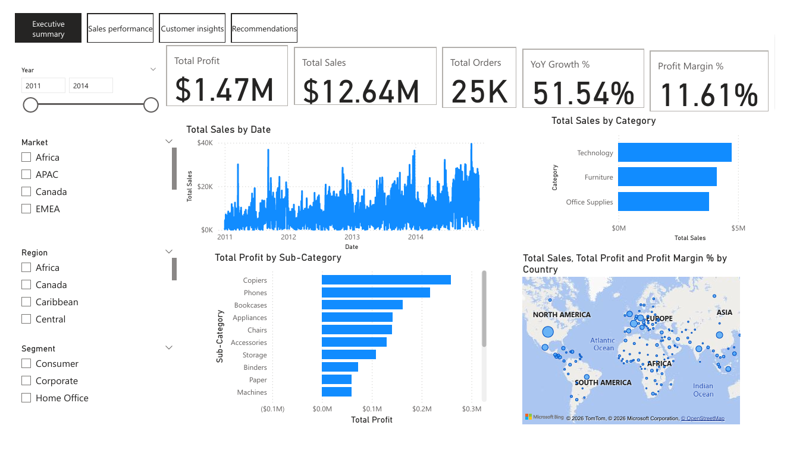
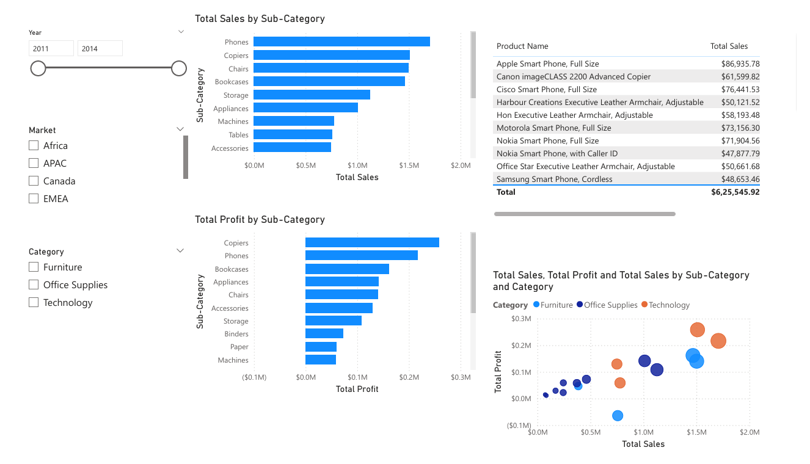
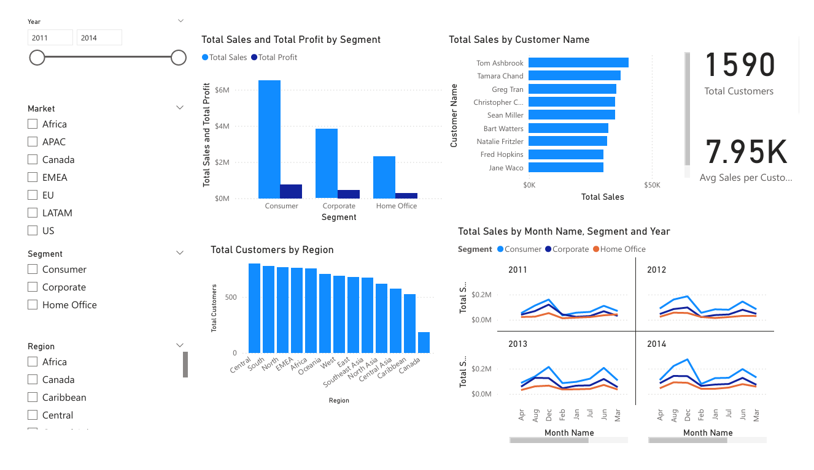

# PowerBi_Sales_Dashboard
This project is an end-to-end Business Intelligence dashboard built in Power BI using the Global Superstore dataset. The goal was to analyze sales performance, profitability, and customer behavior to generate actionable business insights.

# Tools & Skills Used
Power BI.

Power Query (Data Cleaning & Transformation)
Star Schema Data Modeling
DAX Measures (Sales, Profit Margin, YoY Growth)
Data Visualization & Dashboard Design

# Key Features
Executive Summary with KPI cards
Sales trend analysis (Year-over-Year growth)
Top 10 products & customers analysis
Customer segmentation insights
Identification of loss-making sub-categories
Business recommendations page

# Key Insights
Identified high-performing product categories
Highlighted loss-generating sub-categories
Analyzed customer segments contributing most revenue
Provided strategic recommendations for improving profitability

# File Included
*Power BI (.pbix) file
*Dashboard screenshots

# Dax Key measures developed
Total Sales = SUM(Fact_Sales[Sales])

Total Profit = SUM(Fact_Sales[Profit])

Profit Margin % = DIVIDE([Total Profit], [Total Sales])

Total Orders = DISTINCTCOUNT(Fact_Sales[Order ID])

YoY Growth % =
VAR CurrentYearSales = [Total Sales]
VAR PreviousYearSales =
    CALCULATE(
        [Total Sales],
        SAMEPERIODLASTYEAR(Dim_Date[Date])
    )
RETURN
DIVIDE(CurrentYearSales - PreviousYearSales, PreviousYearSales)

## 📸 Dashboard Preview

### Executive Summary

### Sales Performance

### Customer Insights

### Recommendations

